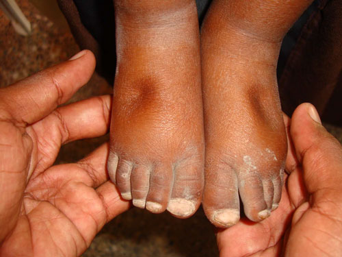
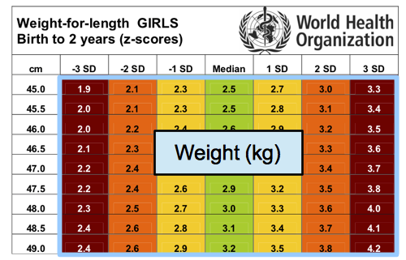
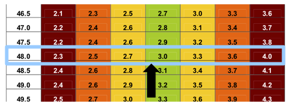
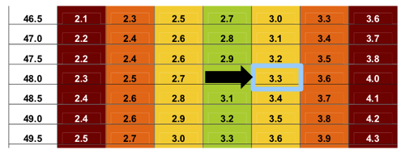

# Childhood undernutrition and anthropometry {#anthro}

Childhood undernutrition is an important global public health issue contributing to nearly half of all deaths in children under 5 and is widespread in Asia and Africa. This chapter discusses the various forms of childhood undernutrition, describes the indices used to diagnose them and the anthropometric measurements performed that will provide data to calculate the various indices.

## Forms of childhood undernutrition
Childhood undernutrition manifests in various forms. It is important to note the use of the term undernutrition rather than malnutrition as this guide will not touch upon overweight and obesity. In this guide, the focus will be on two forms of undernutrition: 1) acute undernutrition; and, 2) chronic undernutrition. Childhood undernutrition manifested as micronutrient deficiencies will not be discussed.

### Acute undernutrition
Childhood **acute undernutrition** is a condition related to a child's acute inadequate nutrition leading to rapid weight loss or failure to gain weight normally. Situations such as acute shortage of food and/or acute episodes of childhood illnesses such as diarrhoea, acute respiratory infections and/or malaria can bring about this rapid weight loss or weight gain failure in children.

\newpage

A. Physical signs and symptoms

Acute undernutrition in a child can manifest in two ways.

1. *Marasmus*: This condition is also called *wasting* given that a child suffering from it presents as _wasted_ with an appearance of _"skin and bones"_ because of _excessive thinness_ that is due to rapid loss of muscle and fatty tissue. Other physical features include the child's face looking like an old man's (_old man facies_ due to loss of facial subcutaneous fat), child's rib cage is easily visible and skin folds on buttocks and thighs appearing like _"baggy pants"_.

2. *Kwashiorkor*: Some children with acute undernutrition develop *nutritional oedema*. Oedema is an accumulation of fluid in the tissue, especially the feet and legs and nutritional oedema is specifically characterised as being _bilateral and pitting_. The child with *kwashiorkor* is _withdrawn_, _irritable_, _obviously ill_ and _will not eat_. The hair is thin, sparse and sometimes discoloured. The skin has symmetrical discoloured patches where the skin later cracks and peels off.

```{r fig.cap = c("Child with bilateral oedema, skin and hair changes", "Bilateral pitting oedema"), echo = FALSE, fig.align = "center", fig.retina = 1}
knitr::include_graphics("images/oedema01.jpg")
cat('\n\n')

```

B. Anthropometric indices

The physical signs and symptoms of acute undernutrition described above are considered pathognomonic of the condition i.e., if these signs and symptoms are found in a child, it is very likely that the child has acute undernutrition. However, other than physical signs, there are anthropometric indices used to diagnose acute undernutrition in children.

1. Weight-for-height/weight-for-length

The first independent criteria for *marasmus* or *wasting* is weight-for-height (WFH)/weight-for-length (WFL). Given *child A*, this child's weight is assessed against the mean weight of a standard group of children in good health with the same height or length as *child A* (length is measured when the child is < 85 cms in height or < 24 months old). *Child A* is expected to have a weight close to the mean weight of the standard group of healthy children if *child A* is also healthy and is not undernourished. However, if *child A*'s weight deviates significantly farther from the mean weight of the standard group of healthy children, *child A* is considered to have low weight for its height and therefore considered *marasmic* or *wasted*. This deviation from the mean, also called *standard deviation (SD)* in statistics, is calculated for each child whose weight and height have been measured and is expressed in terms of *z-scores*. Therefore, the anthropometric index used for *wasting* is weight-for-height z-scores (WHZ) and classification of level of wasting is done based on the following WHZ cut-offs:

+-------------------------+-----------------------------------+
| **WHZ**                 | **Classification**                |
+=========================+===================================+
| WHZ < -2SD              | Global Acute malnutrition (GAM)    |
+-------------------------+-----------------------------------+
| -3SD $\geq$ WHZ < -2SD  | Moderate acute malnutrition (MAM) |
+-------------------------+-----------------------------------+
| WHZ < -3SD              | Severe acute malnutrition (SAM)   |
+-------------------------+-----------------------------------+

2. Mid-upper arm circumference

The other independent criteria for *marasmus* or *wasting* is the *mid-upper arm circumference* or *MUAC*. *MUAC* is a measure of muscle mass and therefore detects loss of muscle mass due to wasting. *MUAC* is a good predictor of mortality and in many studies, *MUAC* predicted death in children better than any other anthropometric indicator. Unlike weight-for-height, *MUAC* is used as an anthropometric index without need for standardisation. The *MUAC* cut-offs used to classify a child as being *marasmic* or *wasted* are:

+-------------------------+-----------------------------------+
| **MUAC (mm)**           | **Classification**                |
+=========================+===================================+
| MUAC < 125              | Global Acute malnutrition (GAM)    |
+-------------------------+-----------------------------------+
| 115 $\geq$ MUAC < 125   | Moderate acute malnutrition (MAM) |
+-------------------------+-----------------------------------+
| MUAC < 115              | Severe acute malnutrition (SAM)   |
+-------------------------+-----------------------------------+

3. Oedema test

The final index for acute undernutrition is *oedema testing* for *kwarshiorkor* cases. This test checks whether _oedema_ is present and whether it is _bilateral_ and _pitting_. Any sign of bilateral pitting oedema, regardless of WHZ or MUAC classification, is considered *severe acute malnutrition*.

&nbsp;

C. Referral for cases with acute undernutrition

Children with acute undernutrition are at higher risk of mortality than children who are not. Children with moderate acute malnutrition are 3 times more likely to die while children with severe acute undernutrition are 5 times more likely to die than their non-undernourished counterparts. It is therefore important that when children are identified as having acute undernutrition based on the anthropometric indices described above, they are referred accordingly for treatment. For MUAC and oedema, the diagnosis of acute undernutrition is clear and straightforward and those who measure or check for them would be able to immediately determine child's nutritional status and refer accordingly. With the weight-for-height index, the process is less straightforward because the weight and height measurements will have to be converted into z-scores which in turn are used to check against the stated cut-offs. In order to facilitate this conversion to z-scores particularly on-the-go in a field survey setting, the WHO provides reference tables that can be used to look up a child's height/length and weight in the appropriate reference table specific to the child's sex and age and then be able to determine the child's z-score. The reference tables are shown (and can be downloaded) below.

```{block2, type = "rmddownload"}
Download the reference tables for boys 0-23 months [here]("pdf/boys_0_24.pdf").
```

```{block2, type = "rmddownload"}
Download the reference tables for girls 0-23 months [here]("pdf/girls_0_24.pdf").
```

```{block2, type = "rmddownload"}
Download the reference tables for boys 24-59 months [here]("pdf/boys_24_60.pdf").
```

```{block2, type = "rmddownload"}
Download the reference tables for girls 24-59 months [here]("pdf/girls_24_60.pdf").
```

\newpage

```{r anthro1, fig.cap = c("Reference tables for boys 0-23 months", "Reference tables for boys 24-59 months", "Reference tables for girls 0-23 months", "Reference tables for girls 24-59 months"), echo = FALSE, fig.align = "center", fig.retina = 1, fig.pos = "H", out.width = "100%"}  
knitr::include_graphics(c("pdf/boys_0_24.pdf", "pdf/boys_24_60.pdf", "pdf/girls_0_24.pdf", "pdf/girls_24_60.pdf"))
```

```{block2, type = "rmdexercise"}
**Case: During the survey, you found a 10 month old girl with a length of 48.0 cms and weight of 3.3 kgs.**

In this example, you will have to use the reference table for girls 0-24 months old.

Find the length of the child on the reference table. In the left-most column of the reference table you will find the values for the length in centimetres. So for this child, you should look for 48.0 cm length in the left-most column.

 

Once you have found the girl's length in the left-most column, you now have to look for the girl's weight in the body of the table. Specifically, you should look for the girl's weight along the row corresponding to her length.

 

The weight of the child (3.3 kg) is indicated in the figure below.



Then, to determine the z-score corresponding to the girl's height and weight, look up to the the uppermost row (header row) of the table where you will find the z-score values. Specifically, you should look up to the uppermost row (header row) of the column corresponding to the weight of the child.

 

So, in this example, the girl has a z-score of `+1SD`. The girl is not acutely undernourished.
```

### Chronic undernutrition
Childhood **chronic undernutrition** is a condition related to a child's exposure to inadequate nutrition over a long period of time leading to failure of linear growth. Stunted growth reflects a process of failure to reach linear growth potential as a result of suboptimal health and/or nutritional conditions.

&nbsp;

A. Physical signs and symptoms

A child suffering from chronic undernutrition is also called *stunting/stunted*. Such a child is said to be short for its age (see below).

&nbsp;

B. Anthropometric indices

Like with acute undernutrition, an index is used to classify whether a child has chronic malnutrition or not. This index is called height-for-age (HFA) or length-for-age (LFA). Given *child B*, this child's length/height is assessed against the mean length/height of a standard group of children in good health with the same age as *child B*. *Child B* is expected to have a length/height close to the mean length/height of the standard group of healthy children if *child B* is also health and well-nourished. However, if *child B*'s length/height deviates significantly farther from the mean height of the standard group of healthy children, *child B* is considered to have low height for its age and therefore considered to be *stunting* or *stunted*. This deviation from the mean, also called *standard deviation (SD)* in statistics, is calculated for each child whose height has been measured and is expressed in terms of *z-scores*. Therefore, the anthropometric index used for *stunting/stuntedness* is height-for-age z-scores (HAZ) and classification of level of stunting/stuntedness is done based on the following WHZ cut-offs:

+-------------------------+-----------------------------------+
| **HAZ**                 | **Classification**                |
+=========================+===================================+
| HAZ < -2SD              | Global stunting/stuntedness       |
+-------------------------+-----------------------------------+
| -3SD $\geq$ HAZ < -2SD  | Moderate stunting/stuntedness     |
+-------------------------+-----------------------------------+
| HAZ < -3SD              | Severe stunting/stuntedness       |
+-------------------------+-----------------------------------+

\newpage

## Performing anthropometric measurements

As described in this chapter, to be able to assess the anthropometric indices for acute and chronic undernutrition four (4) anthropometric measurements needs to be collected: 1) *weight*; 2) *height*; 3) *mid-upper arm circumference (MUAC)*; and, 4) *oedema*. In addition to these anthropometric measurements, information on the child's *age (in months)* and *sex* will also be needed to be able to determine the appropriate reference standards to use in calculating the child's corresponding anthropometric indices. The next chapters provide detailed directions on how to perform the various anthropometric measurements accurately.

