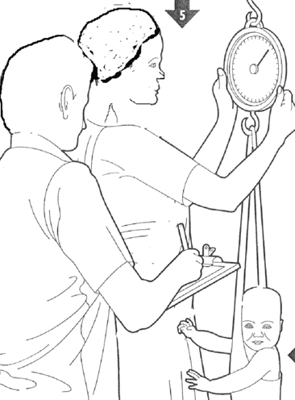
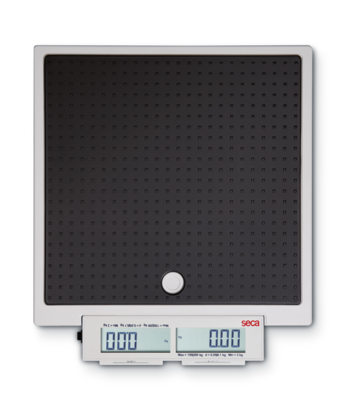

# Performing anthropometric measurements {#anthro2}

As described in [Chapter 2](#anthro1), to be able to assess the anthropometric indices for acute and chronic undernutrition four (4) anthropometric measurements needs to be collected: 1) *weight*; 2) *height*; 3) *mid-upper arm circumference (MUAC)*; and, 4) *oedema*. In addition to these anthropometric measurements, information on the child's *age (in months)* and *sex* will also be needed to be able to determine the appropriate reference standards to use in calculating the child's corresponding anthropometric indices. This chapter provides detailed directions on how to perform anthropometric measurements accurately.

## Measuring weight

### Equipment: Weighing scales

A. Types of weighing scales

Various types of scales are available to measure the weight of a child: 1) *spring scales*; 2) *hanging scales*; 2) *beam balance scales*; and, 3) *digital scales*.

*Spring scales* are the most common type of scales used worldwide. *Hanging scales* are a kind of *spring scale* that is hung from a height instead of laid flat on the ground. *Hanging scales* are commonly preferred in many countries because they can be transported easily, can be used in almost any setting (particularly where a flat surface is not available) and are relatively inexpensive. However, they are not very accurate and as such are not recommended for use in nutrition surveys.

 

&nbsp;

 

&nbsp;

*Balance beam scales* are commonly used in health centers, as they need to be positioned on a flat surface for accurate measurement and are not easily transported.

*Digital scales* on the other hand are highly accurate (for as long as it is powered adequately and consistently), easily transportable though requiring a flat surface on which to be laid upon. They are generally of high quality and rugged for frequent field use as is needed for a nutrition survey. This is why *digital scales* are what's currently recommended for use in anthropometric measurements in a field survey setting.

In addition to being a *digital scale*, it is recommended to weigh children using a scale with the following features:

* Solidly built and durable

* Electronic (digital reading)

* Measures up to 150 kg

* Measures to a precision of 0.1 kg (100g)

* Allows tared weighing

**“Tared weighing”** means that the scale can be re-set to zero (*“tared”*) with the person just weighed still on it. Thus, a mother can stand on the scale, be weighed, and the scale tared. While remaining on the scale, if she is given her child to hold, the child’s weight alone appears on the scale. 

*Digital scales* that allow for **tared weighing** have very clear advantages:

* There is no need to subtract weights to determine the child’s weight alone (reducing the risk of error).

* The child is likely to remain calm when held in the mother’s arms for weighing.

Currently, the most commonly used digital tared weighing scale is the **UNICEF Electric Scale (UNISCALE)** which is produced by **SECA** (the non-UNICEF branded scale is the **SECA model 890** or **SECA model 874**)

B. General use, care and maintenance of SECA tared scales

1. Place the scale on a hard, level surface (wood, concrete, or firm earth). Soft or uneven surfaces may cause small errors in weighing. It is therefore advisable that each survey team are provided with a wooden plank that can be laid on top of unlevel ground as a way to even out the surface. The plank should be big enough to cover a reasonable surface and sturdy enough to carry the weight of the scale and those being weighed.

2. The scale will not function correctly if it becomes too warm.  It is best to use the scale in the shade, or indoors.  If the scale becomes hot and does not work correctly, place it in a cooler area and wait 15 minutes before using again.

3. The scale must adjust to changes in temperature. If the scale is moved to a new site with a different temperature, wait for 15 minutes before using the scale again. It is advisable to test the scale before every measurement when the scale is moved and operated in extreme weather conditions.

4. The scale must be tested every single day of fieldwork. This is best done using a labelled standard weight of 2.5 - 5.0 kg. This can be purchased locally, but must be tested initially to ensure that the indicated weight is accurate. Record the results of the daily test of the scale, including the date and weight. Using other types of standard weights is possible, but is not recommended. Some surveys have in the past used filled water bottles for testing, but as water or other liquids evaporate, this technique is flawed. Sand is a viable alternative, but only if labelled weights are not available.

5. Handle the scale carefully:
    * Do not drop or bump the scale.
    * Do not weigh loads with a total weight of more than 150 kg.
    * Do not store the scale in direct sunlight or other hot places.
    * Protect the scale against excess humidity or wetness.
    * Do not use the scale at temperatures below 10º C or above 45º C.
        
6. The scale is battery-powered. Around 120,000 weighings can be performed with a fresh set of batteries.

