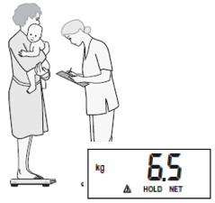

# Measuring weight {#weight}

## Equipment

Weighing scales are the equipment needed for measuring weight.

### Types of weighing scales

Various types of scales are available to measure the weight of a child: 1) *spring scales*; 2) *hanging scales*; 2) *beam balance scales*; and, 3) *digital scales*.

*Spring scales* are the most common type of scales used worldwide. *Hanging scales* are a kind of *spring scale* that is hung from a height instead of laid flat on the ground. *Hanging scales* are commonly preferred in many countries because they can be transported easily, can be used in almost any setting (particularly where a flat surface is not available) and are relatively inexpensive. However, they are not very accurate and as such are not recommended for use in nutrition surveys.

```{r fig.cap = "Bathroom scale (spring)", echo = FALSE, fig.align = "center", fig.retina = 1}

```

```{r fig.cap = "Hanging scale (spring)", echo = FALSE, fig.align = "center", fig.retina = 1}
knitr::include_graphics("images/hangingScale.png")
```

*Balance beam scales* are commonly used in health centers, as they need to be positioned on a flat surface for accurate measurement and are not easily transported.

```{r fig.cap = "Balance beam scales", echo = FALSE, fig.align = "center", fig.retina = 1}

```

*Digital scales* on the other hand are highly accurate (for as long as it is powered adequately and consistently), easily transportable though requiring a flat surface on which to be laid upon. They are generally of high quality and rugged for frequent field use as is needed for a nutrition survey. This is why *digital scales* are what's currently recommended for use in anthropometric measurements in a field survey setting.

In addition to being a *digital scale*, it is recommended to weigh children using a scale with the following features:

* Solidly built and durable

* Electronic (digital reading)

* Measures up to 150 kg

* Measures to a precision of 0.1 kg (100g)

* Allows tared weighing

**“Tared weighing”** means that the scale can be re-set to zero (*“tared”*) with the person just weighed still on it. Thus, a mother can stand on the scale, be weighed, and the scale tared. While remaining on the scale, if she is given her child to hold, the child’s weight alone appears on the scale. 

*Digital scales* that allow for **tared weighing** have very clear advantages:

* There is no need to subtract weights to determine the child’s weight alone (reducing the risk of error).

* The child is likely to remain calm when held in the mother’s arms for weighing.

Currently, the most commonly used digital tared weighing scale is the **UNICEF Electric Scale (UNISCALE)** which is produced by **SECA** (the non-UNICEF branded scale is the **SECA model 890** or **SECA model 874**)

```{r fig.cap = "SECA scale model 874", echo = FALSE, fig.align = "center", fig.retina = 1}
knitr::include_graphics("images/seca874.png")
```

### General use, care and maintenance of SECA tared scales

1. Place the scale on a hard, level surface (wood, concrete, or firm earth). Soft or uneven surfaces may cause small errors in weighing. It is therefore advisable that each survey team are provided with a wooden plank that can be laid on top of unlevel ground as a way to even out the surface. The plank should be big enough to cover a reasonable surface and sturdy enough to carry the weight of the scale and those being weighed.

2. The scale will not function correctly if it becomes too warm.  It is best to use the scale in the shade, or indoors.  If the scale becomes hot and does not work correctly, place it in a cooler area and wait 15 minutes before using again.

3. The scale must adjust to changes in temperature. If the scale is moved to a new site with a different temperature, wait for 15 minutes before using the scale again. It is advisable to test the scale before every measurement when the scale is moved and operated in extreme weather conditions.

4. The scale must be tested every single day of fieldwork. This is best done using a labelled standard weight of 2.5 - 5.0 kg. This can be purchased locally, but must be tested initially to ensure that the indicated weight is accurate. Record the results of the daily test of the scale, including the date and weight. Using other types of standard weights is possible, but is not recommended. Some surveys have in the past used filled water bottles for testing, but as water or other liquids evaporate, this technique is flawed. Sand is a viable alternative, but only if labelled weights are not available.

5. Handle the scale carefully:
    * Do not drop or bump the scale.
    * Do not weigh loads with a total weight of more than 150 kg.
    * Do not store the scale in direct sunlight or other hot places.
    * Protect the scale against excess humidity or wetness.
    * Do not use the scale at temperatures below 10º C or above 45º C.
        
6. The scale is battery-powered. Around 120,000 weighings can be performed with a fresh set of batteries.

## Personnel

At least two trained personnel are required when performing weight measurement. One is assigned as the **measurer** while the other is assigned as the **assistant**. It is important that prior to the measurement of the weight of a child that these roles are clearly specified and that each personnel knows what their role entails. Switching roles between measurement of different children is acceptable for as long as all personnel are trained on performing the tasks expected of either **measurer** or **assistant**. For specific tasks for each role, see next section.

## Steps in weighing a child

1. *Prepare the child for weighing*

Explain to parents/caretakers that the child needs to remove outer clothing in order to obtain an accurate weight. A wet diaper, or shoes and jeans, can contribute substantially to the measured weight (up to 0.5 kgs) making the measurement inaccurate. Babies should be weighed naked but precautions needs to be put in place to ensure that the baby stay warm while waiting to be weighed and while they are being weighed. They can be wrapped in a blanket to keep them warm while waiting. When being weighed, the adult can be weighed holding a blanket that can be used to wrap around the naked baby during measurement. Older children should remove all but minimal clothing, such as their underclothes. 

If it is too cold to undress a child or if the child resists being undressed and becomes agitated, please weigh the clothed child, but indicate in the questionnaire that the child could not be undressed to the minimum and take a note of the circumstances.

2. *Switch on scale*

The **measurers** should switch on the scale with no weight applied. The **SECA 874** can be turned on by tapping the **start** button. The **SECA 890** can be turned on by covering the solar cells for less than a second.

```{r, fig.cap = "Turning on the SECA 874", echo = FALSE, fig.align = "center", fig.retina = 1}  

```

```{r, fig.cap = "Turning on the SECA 890", echo = FALSE, fig.align = "center", fig.retina = 1}  

```

When the **SECA 890** is switched on, you will first notice the display showing `188.8`. Wait for the display to turn `0.0` before putting any weight onto the scale. The **assistant** on the other hand will be holding onto the paper questionniare or the mobile device. The **assistant** will be in charge of recording the weight measurement.

```{r, fig.cap = "SECA 890 ready", echo = FALSE, fig.align = "center", fig.retina = 1}  

```

3. *Weighing the child*

This step differs between children who are able to stand still on the scale long enough for a measurement to be read and recorded and children who are too young to do so. Generally, children 2 years and above should be able to stand on the scale still on their own long enough. However, it is to the discretion of the **measurer** whether this is the case or not.

a. _Weigh child on scale on their own_

If child is able to stand still on the scale long enough, the child can be weighed alone. **Measurer** should explain to the child that he/she will need to step on to the scale alone and standing very still. **Measurer** will ask the child to stand in the middle of the scale, feet slightly apart and to remain still until the weight appears and that the measurement is retained on the display (about 3 seconds that the measurement is stable with child standing still and not moving the display will stop flashing signifying that the weight display has been stored). It is important that no one holds or supports the child until a weight measurement has been retained on the display successfully as this will interfere with the measurement. If the child does not stand still or is unable or does not want to stand on his/her own, then step b below should performed instead.

The **measurer** then reads out loud the child's weight from the display. The **measurer** should read the measurement entirely including the one decimal place that shows in display (to the nearest 0.1 kg). Note that when using the SECA 874, the weight is displayed with two decimal places but the second decimal number is always 0. The second decimal place is not recorded.

The **assistant** then repeats the weight that has been called out.

The **measurer** then confirms if this is the correct weight. If correct, then the **assistant** records the weight measurement on the paper questionnaire or on the mobile device. If incorrect, **measurer** reads out the measurement again until the **assistant** is able to repeat the correct weight.

The child can then step off the scale.

b. _Tared weighing_

If child is unable to stand still on the scale long enough or if child doesn't want to stand on the scale alone, then this child should be measured using *tared weighing*.

The **measurer** asks the mother/caretaker to step onto the scale and then to stand still. After about 3 seconds, the weight of the mother/caretaker will be displayed.

```{r, fig.cap = "Weighing the adult first on the SECA 874", echo = FALSE, fig.align = "center", fig.retina = 1}  
knitr::include_graphics("images/seca874adult.png")
```

If using the **SECA 874**, the **measurer** will have to press the **2 in 1** key found on the scale. This will store the weight of the mother/caretaker. The display on the device would show `0.0` reading and the word **NET** indicating that the weight of the mother/caretaker has been stored.

```{r, fig.cap = "Taring the SECA 874", echo = FALSE, fig.align = "center", fig.retina = 1}  

```

If using the **SECA 890**, the **measurer** will have to cover the solar cell of the device for less than a second and the display will revert back to `0.0` reading. This indicates that the weight of the mother/caretaker has been stored.

```{r, fig.cap = "Taring the SECA 890", echo = FALSE, fig.align = "center", fig.retina = 1}  

```

The **measurer** then asks the mother/caretaker to hold/carry the baby/child on their arms and to again stand as still as possible. The display will show a weight measure. If the weight display and the message `HOLD` are flashing, it means that the scale is waiting for the measurement to stabilise. The **measurer** should wait for the weight display and the message `HOLD` to stop flashing before reading the weight measurement.

```{r, fig.cap = "SECA 874 on hold", echo = FALSE, fig.align = "center", fig.retina = 1}  

```

Once the weight display has stopped flashing, The **measurer** reads out loud the child's weight from the display. The **measurer** should read the measurement entirely including the one decimal place that shows in display. Note that when using the SECA 874, the weight is displayed with two decimal places but the second decimal number is always 0. The second decimal place is not recorded.

The **assistant** then repeats the weight that has been called out.

The **measurer** then confirms if this is the correct weight. If correct, then the **assistant** records the weight measurement on the paper questionnaire or on the mobile device. If incorrect, **measurer** reads out the measurement again until the **assistant** is able to repeat the correct weight.


