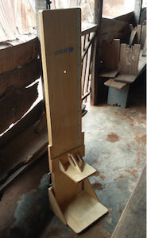
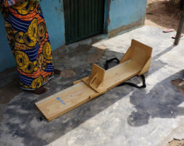
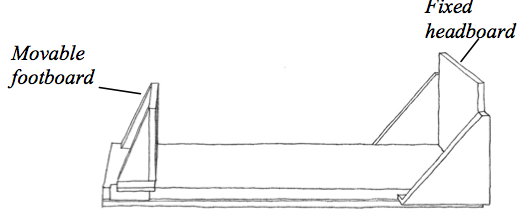
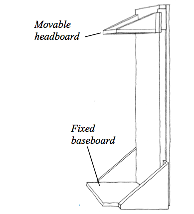
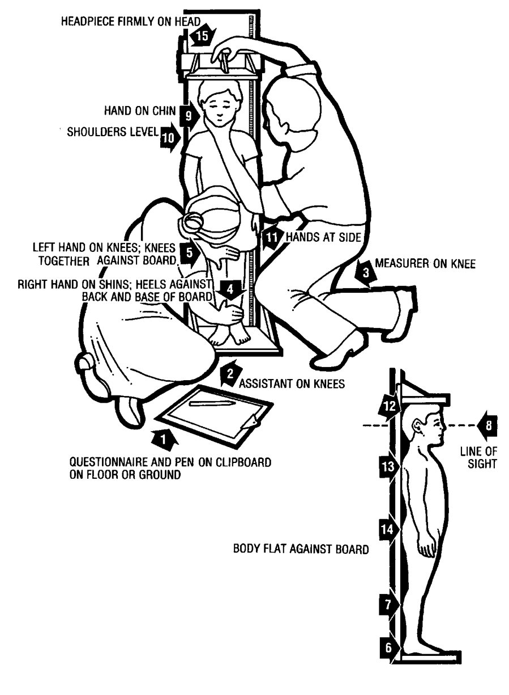
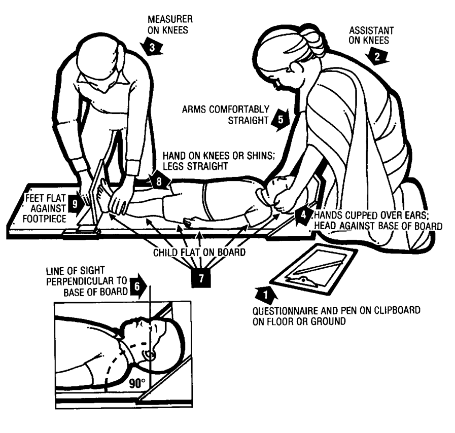
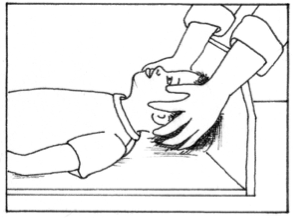
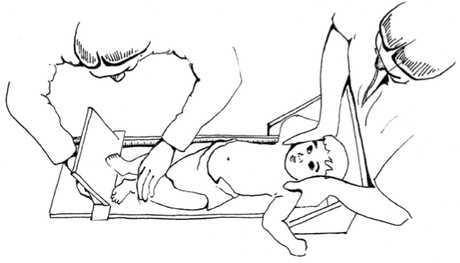

# Measuring height {#height}

## Equipment

A height board, sometimes called a heightometer or stadiometer, is the tool used to measure height of children. It is usually constructed based on a ruler with a sliding horizontal headpiece which adjusts to rest on top of the head. Some common types of height boards are the wooden 2-piece and wooden 3-piece, plastic free-standing, aluminum free-standing and locally-produced boards. Of these, it is preferable to use wooden measuring boards as opposed to aluminum boards which can get very hot in the sun and burn children. The measuring board should be at least 130 cm long and made of hardwood with a hard water-resistant finish. Choice of woods is important. The board should be light enough to be easily carried in the field from house to house. The board should have two tape measures attached to it, one on each side, and they should be marked out in 0.1 cm increments. The board should be easily set upright to measure height with the head piece of the length board becoming the base when the board is set upright.

```{r height01, fig.cap = "2-piece height board standing up", echo = FALSE, fig.align = "center", fig.retina = 1}

```

```{r height02, fig.cap = "2-piece height board lying down", echo = FALSE, fig.align = "center", fig.retina = 1}

```

```{r height03, fig.cap = "2-piece height board folded and carried", echo = FALSE, fig.align = "center", fig.retina = 1}
knitr::include_graphics("images/shorrBrdcarry.jpg")
```

## Personnel

A minimum of two personnel are needed to measure the height or length of a child. If human resources are not an issue, a three-person team would be ideal especially when taking the length of the child. For a two-person team, one is assigned as the **measurer** while the other is assigned as the **assistant**. It is important that prior to the measurement of the height of a child that these roles are clearly specified and that each personnel knows what their role entails. Switching roles between measurement of different children is acceptable for as long as all personnel are trained on performing the tasks expected of either **measurer** or **assistant**. For specific tasks for each role, see next section.

## Steps in measuring length or height of child

Depending on the age of the child, either the weight or the length is measured. For children less than 24 months old (or for height less than 85 cms), length should be measured i.e., height board on recumbent position with the child lying down using a length board which should be placed on a flat, stable surface such as a table.

```{r height04, fig.cap = "Length board flat on a stable surface", echo = FALSE, fig.align = "center", fig.retina = 1}

```

For children 24 months and older, height should be measured i.e., height board on the vertical position with the child standing up (unless child is unable to stand). Use a height board mounted at a right angle between a level floor and against a straight, vertical surface such as a wall or pillar.

```{r height05, fig.cap = "Height board mounted upright", echo = FALSE, fig.align = "center", fig.retina = 1}

```

Measuring children standing up is much easier. Length is much more difficult to measure than height.

Standing height is about 0.7 cm less than recumbent length. This difference was taken into account in developing the WHO growth standards. Therefore, it is important to adjust the measurements if length is taken instead of height, and vice versa.

* If a child less than 2 years old will not lie down for measurement of length, measure standing height and add 0.7 cm to convert it to length.

* If a child aged 2 years or older cannot stand, measure recumbent length and subtract 0.7 cm to convert it to height.

It is recommended that this adjustment to not be made by enumerators during the survey. Instead, an entry in the data collection form / survey instrument should be included that indicates whether measurement made was a height or a length measurement. This will allow adjustments to be made to the height/length measurements post-survey.


### Measuring height

```{r height06, fig.cap = "Steps in measuring height", echo = FALSE, fig.align = "center", fig.retina = 1}

```

1. **Measurer** or **Assistant** should place the measuring board on a hard flat surface against a wall, table, tree, staircase, etc.  Make sure the board is stable. Check that shoes, socks and hair ornaments have been removed.

2.	**Measurer** or **Assistant** should ask the mother to remove the child's shoes and unbraid any hair that would interfere with the height measurement. Ask mother to walk the child to the board and to kneel in front of the child.

3. 	**Assistant** should place the paper questionnaire or mobile device on the ground (**arrow 1**) and kneel with both knees on the right side of the child (**arrow 2**). 

4. **Measurer** should kneel on their right knee only, for maximum  mobility, on the child's left side  (**arrow 3**).

5.	**Assistant** should place the child's feet flat and together in the centre of and against the back and base of the board. The assistant should place right hand just above the child's ankles on the shins (**arrow 4**) with left hand on the child's knees (**arrow 5**) and push against the board making sure the child's legs are straight and the heels and calves are against the board (**arrows 6** and **7**).  The **assistant** then notifies the measurer when positioning of the feet and legs is complete.

6.	**Measurer** tells the child to look straight ahead at the mother if she is in front of the child.  Make sure the child's line of sight is level with the ground (**arrow 8**). **Measurer** places open left hand on the child's chin and gradually closes hand (**arrow 9**) taking care that the child's mouth or ears are not covered. The **measurer** makes sure the shoulders are level (**arrow 10**), the hands are at the child's side (`arrow 11`), and the head, shoulder blades and buttocks are against the board (**arrows 12**, **13** and **14**). With the right hand, the **measurer** lowers the headpiece on top of the child's head making sure that the headpiece pushes through the child's hair (**arrow 15**).

7.	**Measurer** and **Assistant** should check the child's position (**arrow 1-15**) and repeating any steps necessary.

8. When the child's position is correct, the **measurer** reads and calls out the measurement to the nearest 0.1cm.  Then, the **measurer** removes the headpiece from the child's head and releases the left hand from the child's chin and supports the child during the recording.

9.	**Assistant** immediately records the measurement and shows it to the **measurer**.

10.	**Measurer** checks the recorded measurement on the questionnaire for accuracy and legibility and instructs the **assistant** to erase and correct any errors.

```{block2, type = "rmdnote"}
If you are unsure or not confident in the precision of the child's age (over age 2), please take measurement as described above. If the child's height is measured to less than 85 cm, you must instead measure the child's length (see [Measuring length]).
```

```{block2, type = "rmdwarning"}
Common mistakes when measuring height include 1) child leaning to one side; 2) heels not touching the board; 3) hands not at side.
```

### Measuring length

```{r height07, fig.cap = "Steps in measuring length", echo = FALSE, fig.align = "center", fig.retina = 1}

```

1. **Measurer** or **assistant** places the measuring board on a hard flat surface, such as the ground, floor or a steady table. Cover the length board with a thin cloth or soft paper for hygiene and for the baby’s comfort.

2.	**Assistant** places the paper questionnaire or the mobile device on the ground, floor or table (**arrow 1**) and kneels with both knees behind the base of the board, if it is on the ground or floor (**arrow 2**).

3.	**Measurer** kneels on the child's right side and holds the footpiece with right hand (**arrow 3**).

4. With the mother's/caretaker's help, the **measurer** and **assistant** should lay the child on the board. The **assistant** should support the back of the child's head with hands and gradually lower the child onto the board. The **measurer** on the other hand supports the child at the trunk of the body.

5. **Measurer** or **assistant** asks the mother/caretaker to kneel on the opposite side of the board facing the measurer to help keep the child calm.

6. **Assistant** cups hands over the child's ears (**arrow 4**). With arms comfortably straight (**arrow 5**), **assistant** places the child's head against the base of the board so that the child is looking straight up. The child's line of sight should be perpendicular to the ground (**arrow 6**). The **assistant's** head should be straight over the child's head and looking directly into the child's eyes.

```{r height08, fig.cap = "Positioning child's head against the base of the board", echo = FALSE, fig.align = "center", fig.retina = 1}

```

7. **Measurer** makes sure the child is lying flat and in the centre of the board (**arrow 7**) and places left hand on the child's shins (above the ankles) or on the knees (**arrow 8**) pressing them firmly against the board. Note that With the right hand, **measurer** places the footpiece firmly against the child's heels (**arrow 9**).

```{r height09, fig.cap = "Measurer and assistant working together to position child", echo = FALSE, fig.align = "center", fig.retina = 1}

```

8. **Measurer** and **assistant** checks the child's position (**arrows 4-9**) and repeats any steps as necessary to correct child's position.

9. When the child's position is correct, **measurer** reads and calls out the measurement to the nearest 0.1 centimetre. The **measurer** then removes the footpiece, releases left hand from the child's shins or knees and supports the child during the recording. 

10.	The **assistant** then immediately releases the child's head, records the measurement on the paper questionnaire or mobile device and shows it to the **measurer**. Alternatively, the **assistant** calls out the measurement and have the **measurer** confirm by repeating back.

11.	**Assistant** records whether the child was measured lying down or standing up.

12.	**Measurer** checks the recorded measurement on the questionnaire for accuracy and legibility then instructs the assistant to cancel and correct any errors.

```{block2, type = "rmdnote"}
If you are unsure or not confident in the precision of the child's age (under age 2), take measurement as described above. If the child's length is measured to 85 cm or more, you must instead measure the child's height (see [Measuring height]).
```

```{block2, type = "rmdwarning"}
Common mistakes when measuring length include 1) toes pointed; 2) knees bent; 3) head lifted off the board.
```

```{block2, type = "rmdremind"}
\item The measuring boards should be at least 130 cm in length and be made of treated wood.
\item There should be measuring tape on both sides of the measuring board.
\item The measuring board must be cleaned before being stored.
\item Record measurements to the nearest 0.1 cm.
```
