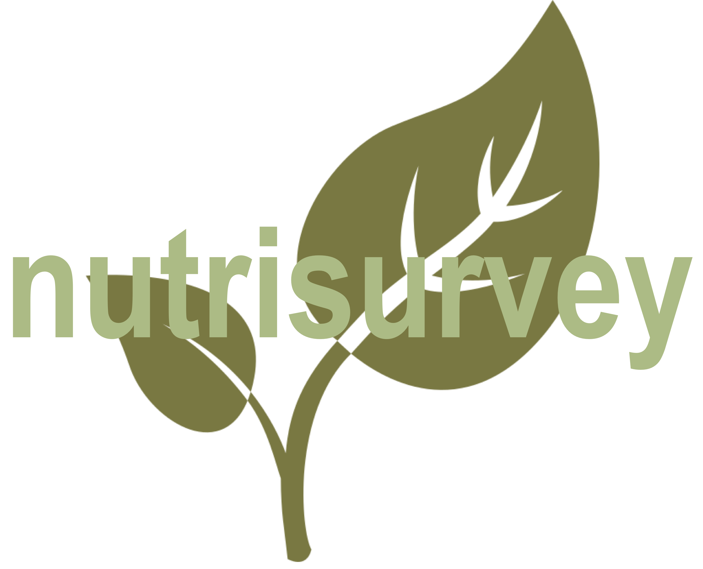

--- 
title: "A Guide to Implementing Nutrition and Food Security Surveys"
author: "Valid International"
date: "05/03/2018"
site: bookdown::bookdown_site
documentclass: book
bibliography: ["book.bib"]
biblio-style: "apalike"
link-citations: TRUE
links-as-notes: FALSE
colorlinks: TRUE
fontsize: 12pt
url: https\://nutrisurvey.validmeasures.org
github-repo: validmeasures/nutrisurvey
cover-image: images/nutrisurvey.png
description: "A guide to nutrition and food security surveys"
---

# Welcome to Nutrisurvey {-}

